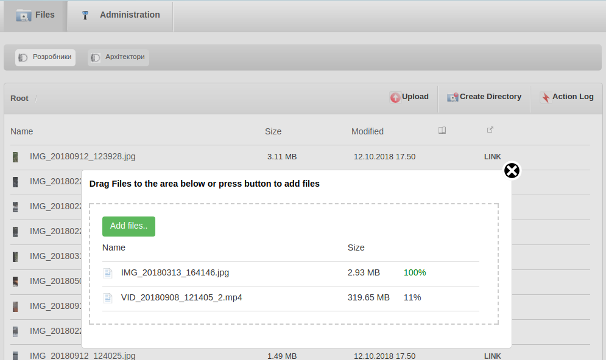
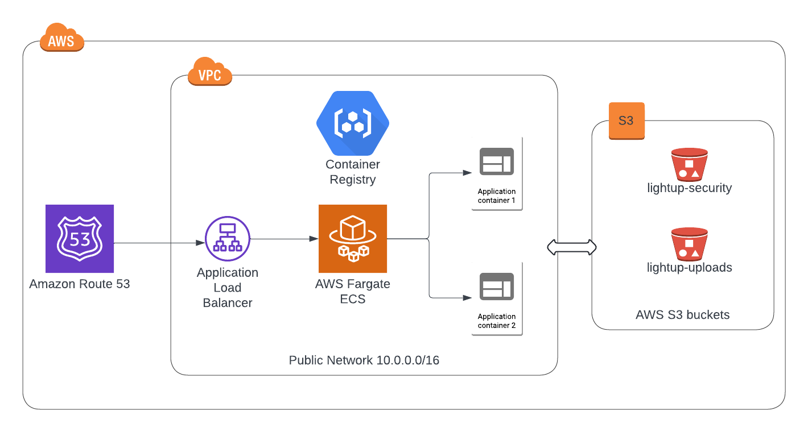

[](https://github.com/vshymanskyy/StandWithUkraine/blob/main/docs/README.md)

# Platonic Ray

Drawing from Plato’s Allegory of the Cave, "Platonic Ray" shines a light on what cloud storage really means.

This high-performance file synchronization server empowers architects, photographers, journalists, and 
small businesses with complete transparency and control over their data -- unlike murky typical providers who hide their 
systems and siphon your info.

Core Features

1. **File Synchronization**

    Intelligent file locking, versioned deletion, effortless movement operations, and smart conflict resolution that works for you, not against you.
    Seamless background file synchronization across Windows, Android, and iOS devices.

2. **Thumbnails & watermarks**

    Need a quick preview? Thumbnails generate on demand via a dedicated process—fast and efficient. 
    Toss a watermark.png in your bucket, and it’s automatically stamped on every thumbnail. 
    Perfect for photographers and designers who need to protect their intellectual property while maintaining efficient workflows.

3. **File & directory sharing**

    Share files or folders securely with an API key signing every request. It’s not just about collaboration—think bigger: sell digital content like stock photos, blueprints, or video clips directly from your platform. Your data, your rules, your revenue.

4. **Action log and changelog**

    Never lose track of what’s happening. Every upload, copy, move, rename, or delete gets logged, giving you a crystal-clear history. Whether you’re auditing changes or settling a “who did what” debate, this keeps your workflow transparent and accountable.

5. **Multi-tenancy**

    Keep things tidy with isolated “buckets” (e.g., the-tenant-group-res). Only your team or group gets access—no crossover, no leaks. It’s a game-changer for healthcare practices juggling patient files or studios managing client projects securely.

6. **IOS and Windows apps**

    Manage files, users, groups, and tenants from anywhere—via a slick Web UI or the iOS app. Whether you’re in the office or on-site, you’ve got full control at your fingertips. Simple, intuitive, and built for real-world use.

7. **API**

    Embed file sharing into your own apps with our easy-to-use API (see API reference (API.md)). Customize it for your workflow—think private file-sharing portals, automated backups, or integrating with your existing tools.

    [See API reference](API.md)



## Why It’s a Big Deal

**Private File Sharing**: Host your own disaster-proof storage on-premises and scale as needed—highly available, no middleman.

**Team Collaboration**: Share massive files, lock what you’re working on, track every change, and search everything with full-text support. LAN sync keeps it blazing fast locally.

**Media Workflows**: Upload HD videos or live streams in a snap, replicate data to multiple clusters (CDN, analytics, transcoding)—all at once.

**Multi-Datacenter Power**: Spread your data across locations for compliance (GDPR, CCPA), lower latency, and better performance.


## Why Erlang

Platonic Ray is built on Erlang, and that’s no accident—it’s the backbone that keeps this platform fast, 
tough, and true to its promise of clarity. Here’s why it matters to you:

**Rock-Solid Resilience**: Erlang apps don’t just crash and burn. If something goes wrong, processes restart instantly, keeping your file sync humming along. For architects juggling deadlines or journalists racing to publish, that means no downtime, no excuses—just reliability you can count on.

**Seamless Node-to-Node Chatter**: Erlang’s inter-node communication is top-notch, making multi-datacenter replication and LAN sync feel effortless. Whether you’re distributing HD video across clusters or keeping a team in sync across locations, your data moves fast and stays in step—up to that 10 Gbit/s promise.

**Secure by Design**: Code runs in the Erlang Virtual Machine (BEAM), locking down each segment of code and data in its own safe little bubble. It’s like the walls of Plato’s cave turning into a fortress—your info stays isolated and protected, far from the prying hands of murky cloud providers.


### It's ready for deployment on AWS using CDK

[See CDK "How to install on AWS" document](cdk/README.md)

**Architecture is simple**:



### Local Installation

You will need the following dependencies.

* Erlang >= 23, < 25

* coreutils ( ``"/usr/bin/head"``, ``/bin/mktemp`` commands )

* imagemagick-6.q16

* libmagickwand-dev


#### 1. Build Riak CS

[See Riak CS Installation Manual](/doc/riak_cs_setup.md) for installation and configuration instructions.

#### 2. Build Platonic Ray

Clone this repository and execute the following commands.
```sh
make fetch-deps
make deps
make
```

In order to use specific version of Erlang, you should set environment variables 
*C_INCLUDE_PATH* and *LIBRARY_PATH*. For example:
```sh
export C_INCLUDE_PATH=/usr/lib/erlang/usr/include:/usr/include/ImageMagick-6:/usr/include/x86_64-linux-gnu/ImageMagick-6
export LIBRARY_PATH=/usr/lib/erlang/usr/lib:/usr/include/ImageMagick-6
```

The following imagemagic packages are required:
imagemagick-6.q16 libmagickcore-6-arch-config libmagickwand-6.q16-dev

#### 3. Edit configuration files

You need to change ``api_config`` in ``include/storage.hrl``.
Locate ``riak-cs.conf`` in Riak CS directory. Copy ``admin.key`` value from ``riak-cs.conf``
and paste it to ``access_key_id`` in ``riak_api_config``.

Then locate ``riak.conf`` in Riak directory and place value of ``riak_control.auth.user.admin.password``
to ``include/riak.hrl``, to the ``secret_access_key`` option.

In order to add first user, authentication should be temporary disabled.

Then start PlatonicRay by executing ``make run``.


Now you should change ``general_settings`` in ``include/general.hrl`` and set
``domain`` option to IP address or domain name that you use.
Otherwise login won't work.

You can login now using credentials of staff user that you have just created.
Staff user has permission to add other users.


# Contributing

Please feel free to send me bug reports, possible securrity issues, feature requests or questions.
