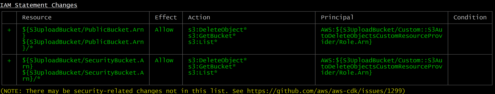
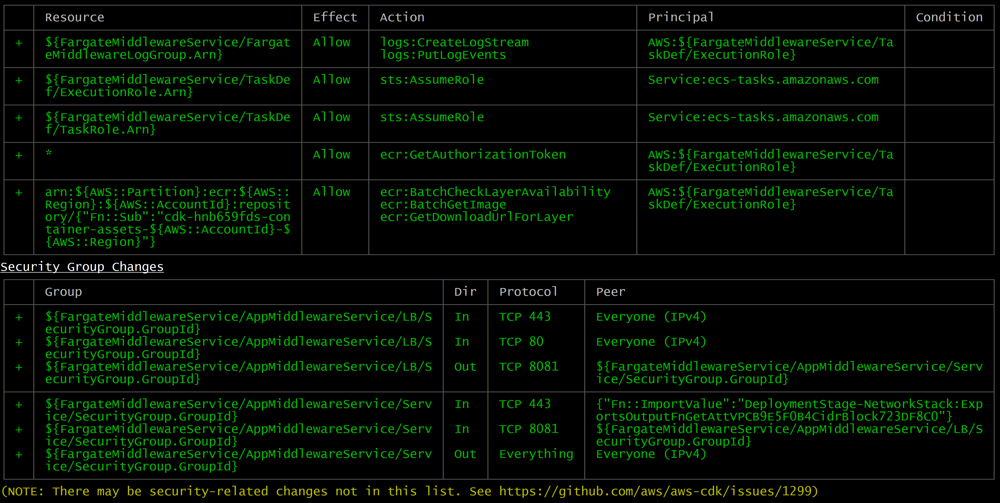

How to use it
=============

1. python -m venv .venv .venv

2. pip3 install -f requirements.txt

3. cdk bootstrap "aws://612528789372/us-east-2"

4. Deployment was split to several sections, in order to make it possible
   to integrate with CI, which could limit time of script execution.

 cdk deploy DeploymentStage/NetworkStack
 cdk deploy DeploymentStage/RestApiStack
 cdk deploy DeploymentStage/S3UploadBucket
 cdk deploy DeploymentStage/FargateMiddlewareService

The following resources will be deployed to AWS.

