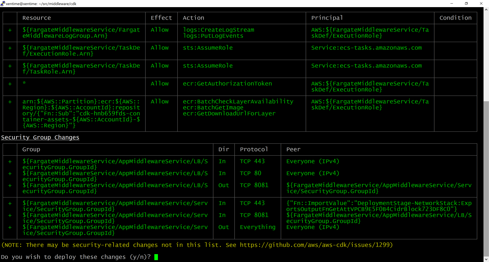

How to use it
=============

1. python -m venv .venv .venv

2. pip3 install -f requirements.txt

3. cdk bootstrap "aws://REPLACE_ME/us-east-2"

   ( replace with your account id )

4. Deployment was split to several sections, in order to make it possible
   to integrate with CI, which could limit time of script execution.

 Main application
 cdk deploy DeploymentStage/FargateMiddlewareService

 Ancillary deployments
 cdk deploy DeploymentStage/NetworkStack
 cdk deploy DeploymentStage/RestApiStack
 cdk deploy DeploymentStage/S3UploadBucket

The following resources will be deployed to AWS.

Disclaimer
==========

The reason why AWS was selected as an infrastructure: it is widely used and some of its sercivces are compatible with 3rd party solutions.
For example S3 protocol implementation is used in open-source Riak CS, then OpenAPI, etc.

ECS Fargate was selected, as it is relatively cheap, so you can spawn more than two containers, that are defined in this deployment configuration, to cope with load increase.
